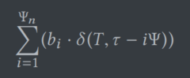
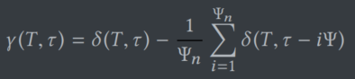
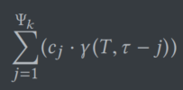
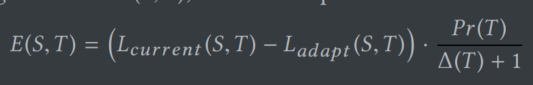

# Tiresias：Enabling Predictive Autonomous Storage and Indexing  

## 亮点

主要的创新点是能够根据过去的对数据的访问预测未来的访问趋势，提前做出存储结构和索引的变化以适应新的事务或分析需求，即：通过训练，学习①访问的时间规律②访问的延迟预测函数。Tiresias只是根据当前和预测的情况，给出判断：是否应该改变布局，而不执行具体的改变布局的操作。

## 应用

1. Proteus中根据HTAP负载调整存储结构

   把事务拆分成操作符（storage-specific），方便预测；

   > 这里的操作符意思是：根据存储结构和工作负载对事务进行拆分形成的单元，比如对于某个事务，分解成以下四个操作符：
   >
   > ① 向数据站点发送请求
   >
   > ② 获取锁
   >
   > ③ 按行更新
   >
   > ④ 提交
   >
   > 文中并未提及操作符是怎么得来的

   调用Tiresias记录操作符延迟和数据访问记录

   预测新的数据访问到来的时间和频率

   最后两步都有API

2. 在OLAP DBMS上的predictive cracking

   预测workload变化，改变数据存储

3. PostgreSQL上的自动索引

   记录查询的到达历史、延迟和是否有二级索引（不在主键上创建的索引）

   预测查询类型、延迟和是否有二级索引

   根据Tiresias的预测，添加或去除二级索引

## 实现

### 数据访问延迟预测

将一个事务拆分成多个相连的操作符，对这些操作符分别计算损失函数再相加

- 输入：a~1~，...，a~n~，是将一个操作符（operator）参数化，根据存储结构和工作负载提取的参数。
- 损失函数F：
  1. **线性回归**：（因为速度快延迟小被采用）
  2. 非线性回归
  3. 神经网络（MLP）
- 采集当前的延迟：采集起止时间和数据读写情况（读写列的总大小等），每个线程有一个observation数据结构，把每一个 <存储结构-操作符> 对应的所有latency保存为一个list，最后汇总在一起，用于训练

### 数据访问预测

预测数据何时将要被以什么频次访问

预测 $δ(T, \tau)$，表示类型 T 的请求在 $\tau$ 时的一个时间窗口内到来的数量

#### SPAR预测器

包含两部分：

1. 长期周期性变化：

   每个小时、每天或者每年的规律。首先设定好要回顾多少个周期，$\psi _n$，考虑 前 $\psi _n$ 个周期的 δ 值，对它们进行加权，权重 b~i~ 需要学习

2. 短期内变化：

   某一个短周期访问量相比于之前周期的变化。此处较难理解。首先看论文给出的公式：

   

   这个公式表示，对于某一个点，比较他的时间窗口内访问量i个周期前(1 ≤ i ≤ $\psi_n$)的对应点的窗口。比如说考虑请求量随时间按照正弦函数分布，如果 $\tau$ 时间在波谷，那么该公式就是将 $\tau$ 时刻的窗口内的访问量减去前 $\psi_n$ 个波谷的窗口内的访问量的平均值。通过该公式衡量当前点与之前周期的对应点的访问量的变化。

   然后将连续 $\psi_k$ 个点的 γ 值加权求和。

   

   这两个公式结合在一起，意义是预测周期内的访问量变化的周期性。仍然以正弦函数为例，这个函数表征的就是$\psi_k$长度内访问量与n个周期之前$\psi_k$长度的区间内访问量有何差异。随着时间推移，通过这个公式，SPAR学习到的就是 “每个周期正弦函数都会有一个波浪形的下坡” 这个特征。

   然后把这个式子和上面长期周期性变化的式子加起来得到 δ 的预测值

#### Hybrid-Ensemble预测器

包含三部分：

1. 长期周期性变化：

   LSTM

2. 短期变化：

   线性回归

3. 用户自定义holiday list

   设定起止时间和高斯函数(正态分布的概率密度)的参数，如果当前时间在起止时间之间，就用高斯函数计算访问量

**访问历史**

每个分区记录一分钟的访问量，轮询收集，将收集到的访问量用于训练

- SPAR：采集前 $\psi_n$ 周期的数据存在环形缓冲区内
- HE：使用LSTM，但是Tiresias仍需要保存长期的历史记录

### 评估存储结构和索引变化的获利

对于存储布局的改变S，考虑两部分：

1. 改变布局本身的消耗：

   U(S)

2. 改变布局前后的消耗对比（收益）

   对于当前结构和改变后的结构，分别使用相应的预测器预测事务的延迟L~current~和L~adapt~

   计算C(S)：当前请求的消耗函数

   计算时间 $\tau$ 时到达T类型指令的可能性Pr(T)

   计算到下一个T类型指令到来需要的时间Δ(T)

   计算E(S, T)：在某一时间预期请求的消耗函数

   

   E决定于延迟的相对变化、请求到来的可能性、请求到来的时间（估计值）

   特别地，如果当前正在处理该类型请求，那么Pr(T) = 1, Δ(T) = 0，带入就是C(S)，也就是当前结构对于当前类型请求的延迟和改变后结构对当前类型请求的延迟的差值 $L_{current}-L_{adapt}$

最后综合这两部分

$N(S) = \lambda (E(S)+C(S))-U(S)$

λ用于调控两者之间的相对权重

也就是说只有：在λ权重下，改变布局带来的收益大于改变布局本身的损失，即 N > 0，才会认为改变布局是可以获利的

## 实验

### 数据集

- CH-benCHmark：包含TPC-C OLTP workload和TPC-H OLAP workload
- 事务型YCSB workload：10个多键读取-修改-写入事务+1个扫描（5e5行）聚合OLAP查询

### 访问开销估计器对比

线性回归每轮训练耗时比神经网络和非线性回归分别快1500倍和2500倍，尽管精确度稍微低一些，但是对于判断改变的好坏还是足够了

线性回归初始精度更高，这样正好可以快速适应负载。

### 访问预测器对比

SPAR精度更高，但是如果周期数设定不合理误差反而会大很多。预测的更易变（毛糙，因为会从之前的预测中继承噪音）空间开销小

### **PostgreSQL自动索引效果**

workload在5、10、15分钟会发生变化

比较了PortgreSQL+Tiresias, 有索引的PostgreSQL和无索引的PostgreSQL，结果为：

使用Tiresias的索引选取相比于不加索引和加索引，workload完成时间分别快了70%和15%

OLAP情况下，加索引最快，但是加索引会导致更新开销变大，因此OLTP情况下，加索引吞吐率最低，而Tiresias由于可以动态调整，因此在OLAP下与加索引速度相当，OLTP下速度与不加索引相当。

### 源代码

https://github.com/mtabebe/Adaptive-Storage-Tiresias-and-Proteus/tree/master

